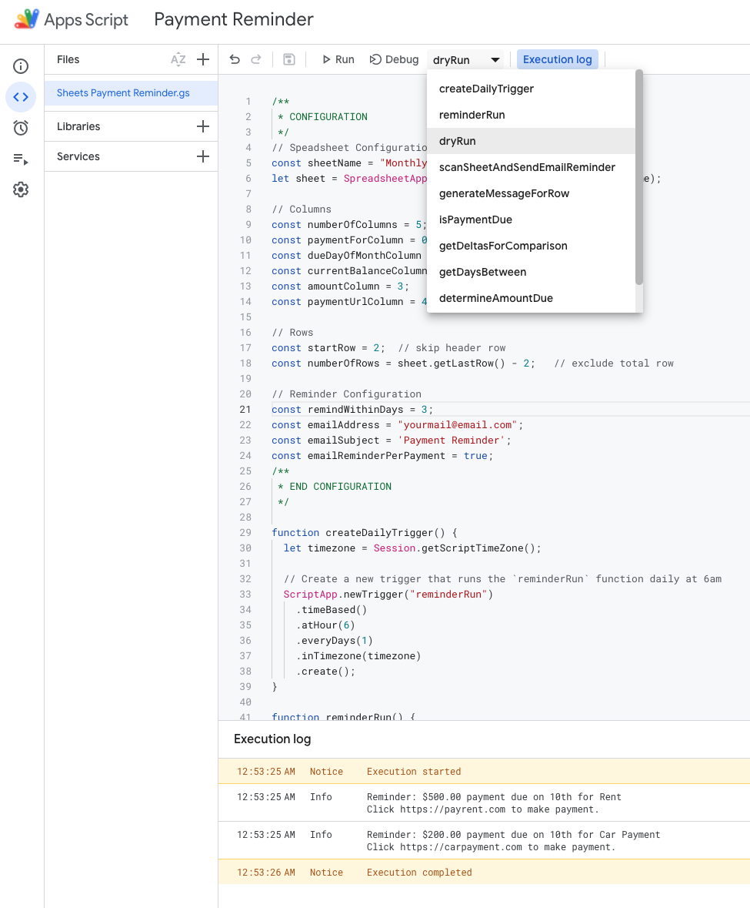
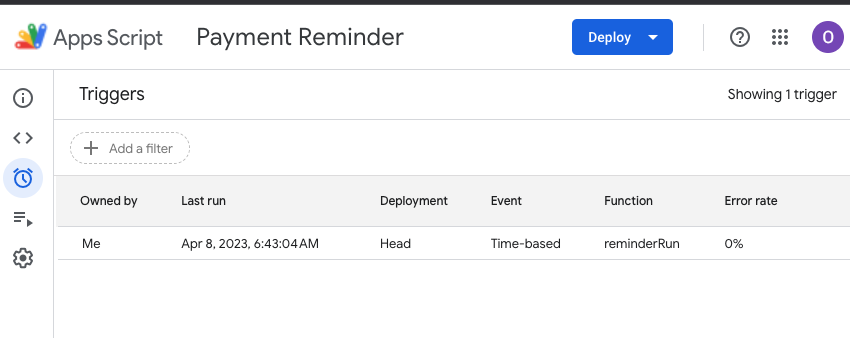

# Payment Reminder (Life Tool Series Vol 1)

This script is a Google Sheets based Payment Reminder Script. 

# Purpose

Keep track of your payments and get email notifications within X days.

# Setup/Usage

Go to [https://sheets.google.com](https://sheets.google.com) and create a new spreadsheet like the following, fill our your information and give a name to your spreadsheet.

| CARDS/MERCHANT | DUE DATE | CURRENT BALANCE/RECURRING/AUTOPAY | Minimum Due/Payment | Payment URL                                                                        |
| -------------- | -------- | --------------------------------- | ------------------- | ---------------------------------------------------------------------------------- |
| Credit Card 1  | 1        | $0.00                             | $0.00               | [https://www.yourbank.com](https://www.yourbank.com/)                              |
| Rent           | 7        | R                                 | $500.00             | [https://payrent.com](https://payrent.com/)                                        |
| Car Payment    | 7        | $5,000.00                         | $200.00             | [https://carpayment.com](https://carpayment.com/)                                  |
| Car Insurance  | 9        | A                                 | $100.00             | [https://carinsurance.com](https://carinsurance.com/)                              |
| Utility Bill   | 12       | A                                 | $92.00              | [https://www.xfinity.com/](https://www.xfinity.com/)                               |
| Credit Card 2  | 23       | $0.00                             | $0.00               | [https://bankcard.com](https://bankcard.com) |
| Total          |          | $5,000.00                         | $892.00             |

# Configuration/Options

## Spreadsheet Options/Utilization

CURRENT BALANCE/RECURRING/AUTOPAY column have 3 options.

```
A                  => Auto pay, no reminders
R                  => Recurring payment, remind every time
Balance Amount > 0 => Sends a reminder
$0.00              => Balance paid, no reminders
```

Use option `A` for your autopay accounts, you will not receive a reminder for AutoPay, if you still want to get reminders for autopay items, use option `R` for recurring payments. For credit cards and other balance based payments, rule to receive a reminder is to have an amount > 0 to in `CURRENT BALANCE/RECURRING/AUTOPAY` column.

## Spreadsheet Configuration 

Firstly, configure your sheet name. 
You can move the columns around as you like, make sure to adjust column mappings accordingly. 
Column indexes start from 0. 

## Reminder Configuration

You can adjust within how many days due you would like a reminder, email address for your reminders, email subject and how many email you like to receive. 

```
const emailSubject = 'Payment Reminder';
const remindWithinDays = 3;                 => sends an email if a payment is due within 3 days
const emailAddress = "yourmail@email.com";  => mails remidner to
const emailReminderPerPayment = true;       => sends an email per payment due, if false, you will receive a single email with all payment dues combined
```

# Reminder Installation

Once you created your spreadsheet, on the top menu, click on `Extensions` > `Apps Script`

In Apps Script, Create a new file and paste the contents of `payment-reminder.js`, you can test your sheet and configuration by running dryRun. 



To setup a daily reminder, run `createDailyReminder` function and confirm from the Triggers screen that your reminder is set!




That's all folks! Enjoy your reminder :) 
